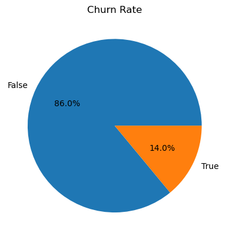

# Customer Churn Analysis  

# OVERVIEW    
Based on the data in the dataset, this project employs machine learning methods to create a model that can precisely predict which customers would churn.The 'churn' variable is the target. The predictive model is created using classification methods because the target variable is a categorical variable.  

# BUSINESS UNDERSTANDING     
## business problem    
The business problem is that SyriaTel is losing customers at an alarming rate. In order to reduce churn, the telecommunication  company needs to identify customers who are likely to leave and take steps to prevent them from doing so.     
Customer churn refers to the phenomenon where customers discontinue their services with the company and switch to a competitor or terminate their subscription altogether. Customer churn is a significant concern for telecommunications companies as it can lead to revenue loss and hinder business growth.    

The stakeholders in this project are the following:     

- Customers: Customers are the primary beneficiaries of this project. By identifying customers who are likely to churn, the company can take steps to prevent them from leaving and improve their customer satisfaction.   
- SyriaTel: SyriaTel is the company that is losing customers. By building a classifier to predict customer churn, the company can take steps to prevent churn and improve its bottom line. 
- other telecommunication companies   

# objectives      

The objectives of this project are:   
- To build a classifier that can accurately predict which customers are likely to churn, 
- Use the classifier to develop strategies for preventing churn.
- Reduce churn and improve SyriaTel's bottom line.

# DATA UNDERSTANDING  
The dat a set used in this project is SyriaTel customer churn dataset.  
The columns include:     

``state``: Categorical feature representing the state of the customer.      
``account`` length: Numeric feature representing the number of days the customer has been with the company.   
``area code``: Numeric feature representing the area code of the customer's phone number.    
``phone number``: Categorical feature representing the customer's phone number.   
``international plan``: Categorical feature indicating whether the customer has an international calling plan.  
``voice mail plan``: Categorical feature indicating whether the customer has a voicemail plan.   
``number vmail messages``: Numeric feature representing the number of voicemail messages.   
``total day minutes``: Numeric feature representing the total number of minutes used during the day.  
``total day calls``: Numeric feature representing the total number of calls made during the day.   
``total day charge``: Numeric feature representing the total charge for day calls.   
``total eve minutes``: Numeric feature representing the total number of minutes used during the evening.  
``total eve calls``: Numeric feature representing the total number of calls made during the evening.   
``total eve charge``: Numeric feature representing the total charge for evening calls.   
``total night minutes``: Numeric feature representing the total number of minutes used during the night.  
``total night calls``: Numeric feature representing the total number of calls made during the night.   
``total night charge``: Numeric feature representing the total charge for night calls.   
``total intl minutes``: Numeric feature representing the total number of international minutes used.   
``total intl calls``: Numeric feature representing the total number of international calls made.   
``total intl charge``: Numeric feature representing the total charge for international calls.   
``customer service calls``: Numeric feature representing the number of customer service calls made.   
``churn``: Boolean feature indicating whether the customer has churned or not.   

# EXPLORATORY DATA ANALYSIS 

### UNIVERIATE ANALYSIS 
This is analysis of one attribute
The dependent variable is the 'Churn' column, which represents whether a customer is likely to churn or not. It is the variable we want to predict. The independent variable(s) are the predictors used to predict the dependent variable   
##### plotting churn rate     

  

The pie chart shows that the majority of customers (86%) did not churn, while a small minority of customers (14%) did churn.  

# MODELING  
* Baseline Model - Logistic Regression  
* Second Model- Random Forest 
* Third model - K-nearest Neighbors(KNN) Model
* Fourth Model - Hyperparameter tuning of the random forest model  
* Fifth Model - Tuned Logistic Regression Model   
Tuned Logistic Regression Model  is the best model to use for this classification process because it has high accuracy and also does not overfit.  
# RECOMMENDATION     
- SyriaTel should look into the total day minutes of the customers and evaluate the charges associated with it.SyriaTel could try to adjust the overall price of the minutes used during the day by giving the customers free minutes if they exceed a certain limits of minutes used during the day.
- SyriaTel should uphold good customer relationship by ensuring the staff dealing with customer service calls help the customers to the best of their ability.
- SyriaTel should adjust the price of the total day calls to avoid losing customers
- SyriaTel should try to engage more with its customers and take their feedback into considerations especially the area code where the churn rate is high
- SyriaTel should audit the prices of the competitors it is losing its customers to and adjust accordingly 
- SyriaTel should encourage its customers to take up international plan as the customers withn international plan have low churn rate.
- SyriaTel should encourage more customers to register for voicemail plan
- Target the needs of customers from area 415 since they have the highest churn rate and try to cater to their needs and get feedback from them to ensure more customers are not churning.

#### AUTHOR:         
marwa Osman: marwaosman9975@gmail.com    

👉 [LinkedIn](https://www.linkedin.com/in/marwa-osman-00190b222/)

👉 [GitHub](https://github.com/marwa9975)